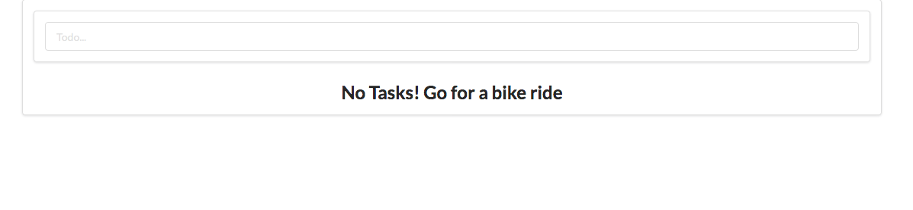
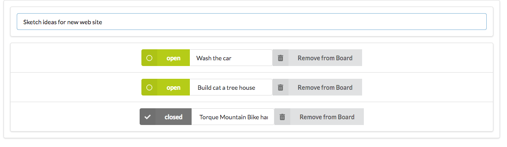
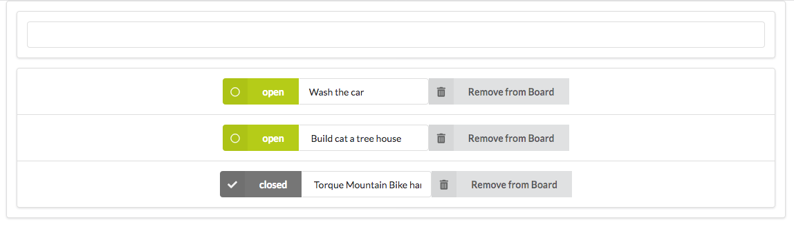

# Todo list in React

React todo List styled with Semantic UI.

## Details
Todo list when no tasks are available

Enter tasks from form input. Once tasks are entered, the input task title is displayed. Task status is marked as "open".

Check off tasks once complete. You can also delete tasks from your list with the delete button on the right.

